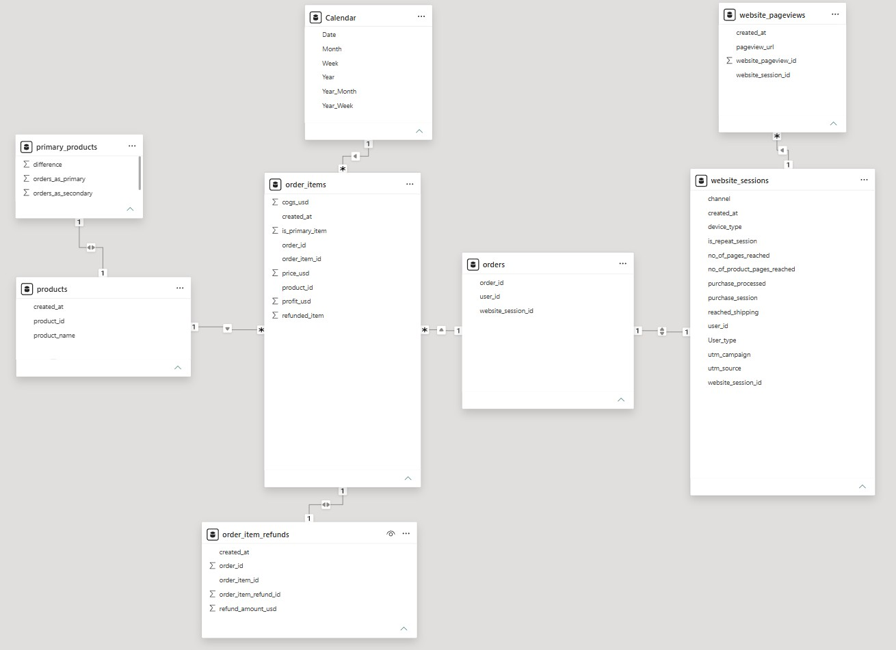
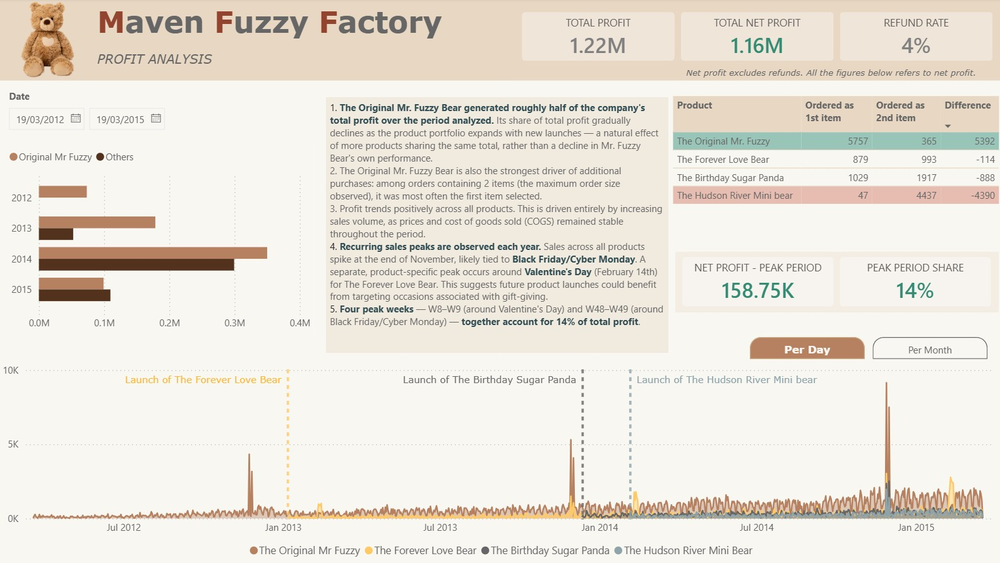
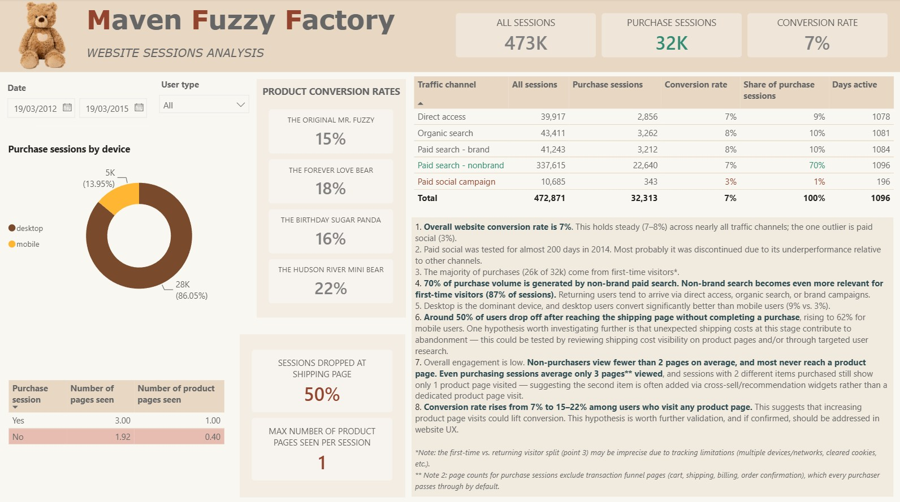

# MAVEN FUZZY FACTORY

Analysis of profit and website sessions data for a fictitious e-commerce business selling teddy bears.

**Dataset source:** kaggle.com
**Technologies used:** SQL, Power Query, Power BI

## I. OBJECTIVES

- Analyze profit trends over a 3-year period, identify key products and potential growth opportunities.
- Analyze website sessions through the lens of traffic channels, conversion rate, and user engagement. Identify improvement opportunities.

## II. ANALYTICAL PROCESS

### 1. DATASET

Dataset consists of 6 tables:
- `orders`
- `order_items`
- `order_item_refunds`
- `products`
- `website_sessions`
- `website_pageviews`

### 2. DATA VALIDATION AND PREPARATION

**MySQL** was used to review the data and prepare it for further analysis and visualisation in Power BI.

**Checks done in SQL:**

1. Checked data consistency (`price` and `cogs` columns) between `orders` and `order_items` tables.
2. Checked whether prices and cogs changed throughout the analysis period.
3. Checked whether refunds were always issued at 100% and whether any refunds referenced non-existing orders.

[SQL checks](sql/price_cogs_refunds_checks.sql)

**Data preparation done in SQL:**

1. Created view for *order_items*, so it inlucdes:
   - *profit_usd* column (price_usd - cogs_usd)
   - a flag column indicating whether the order item was refunded (`refunded_item`)
     
2. Created a view for `website_sessions` containing additional columns:
   - a flag column indicating whether the session ended in a purchase (`purchase_processed`)
   - a flag column indicating whether the `/shipping` page was reached (`reached_shipping`)
   - a count of pages reached during the session (`no_of_pages_reached`); this count excludes purchase funnel pages, since its purpose is to compare user engagement before the purchase decision
   - a count of product pages reached during the session (`no_of_product_pages_reached`), limited to the 4 pages dedicated to the products offered
   - a `channel` column grouping `utm_source` and `utm_campaign` data into 5 traffic channels: *paid search – brand, paid search – nonbrand, paid social, direct, and organic search*
     
3. Created a view for `orders` to streamline the table and remove redundant columns.
   - **Columns kept:** `order_id`, `website_session_id`, `user_id`
   - **Columns removed** (redundant with `order_items`): `created_at`, `primary_product_id`, `items_purchased`, `price_usd`, `cogs_usd`

4. Created a view summarizing primary and secondary products for orders with more than one item (`primary_products`).
   
5. An additional transformation considered was moving prices and cogs from `order_items` to the `products` table, to optimize the dataset. However, the final decision was to keep these figures in `order_items` as the main fact table, to make the model more realistic. This mirrors how such data would be structured in a real-world data model, where future price and cogs changes are expected — unlike in this dataset, where both remained unchanged throughout the period.

### 3. DATA TRANSFORMATION IN POWER QUERY

1. The following tables (or views) were imported into Power Query and then into Power BI:
   - `order_items` (view)
   - `orders` (view)
   - `website_sessions` (view)
   - `order_item_refunds`
   - `products`
   - `website_pageviews`
   - `primary_products`
   
2. Two custom columns were added to `website_sessions` to make the final Power BI visualization more user-friendly. These columns translate numeric flag columns (*0, 1*) into text columns (*yes, no*): `purchase_session` (for `purchase_processed`) and `user_type` (for `is_repeat_session`).

### 4. POWER BI ANALYSIS

The dataset contains details about sales and website traffic, which is reflected in the data model through 2 main fact tables: `order_items` and `website_sessions`.

Following this logic, the dashboard is divided into 2 parts:
- Profit analysis
- Website sessions analysis

It was a deliberate decision to analyze the numbers from a profit rather than sales perspective, after a background check showed that both approaches reveal similar trends and proportions between products, leading to the same conclusions.

An additional Calendar table was added in Power BI using a DAX formula.

